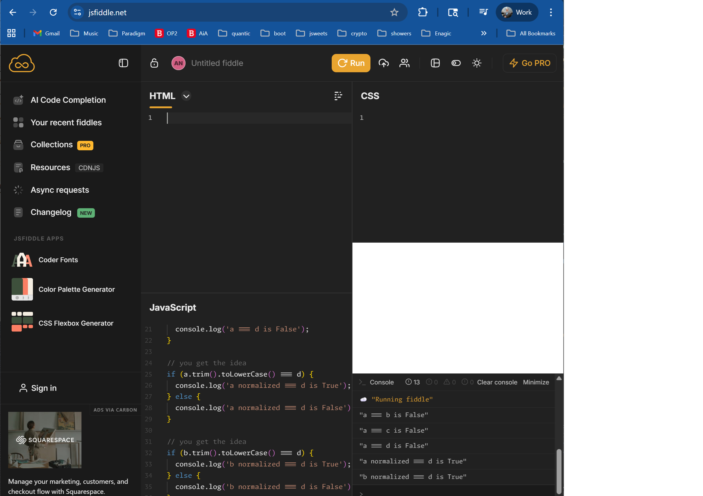

# StringNormalization

<div>
<strong>Author:</strong> Scott Morgan<br/>
<strong>Created:</strong> 2025-11-25<br/>
<strong>Edited:</strong> 2025-12-02<br/>
<strong>Id:</strong> 1.3.6.1.4.1.33097.5.1<br/>
<strong>Copywrite 2025 Adligo Inc</strong>
</div>

Where [RelationalNormalForms#1.3.6.1.4.1.33097.5.0](RelationalNormalForms.md) are mostly concerned with de-duplicating arbitrary large [Datums#1.3.6.1.4.1.33097.5.0.1.6](RelationalNormalForms.md#1.3.6.1.4.1.33097.5.0.1.6).  StringNormalization is concerned with de-duplicating individual strings of characters.

# 1SNF String Normal Form

1.3.6.1.4.1.33097.5.1.1 

Normalization of Strings is a simple two step process;

- 1) Trim the whitespace off both sides of the string.

```
a.trim()
```

- 2) Convert all the characters to lower case in the string.

```
b.toLowerCase()
```

### Example of working code

The following code can be executed to illustrate this concept at [https://jsfiddle.net/](https://jsfiddle.net/);

```

let a = 'John '
let b = ' John'
let c = 'John'
let d = 'john'

if (a === b) {
  console.log('a === b is True');
} else {
  console.log('a === b is False');
}

if (a === c) {
  console.log('a === c is True');
} else {
  console.log('a === c is False');
}

if (a === d) {
  console.log('a === d is True');
} else {
  console.log('a === d is False');
}

// you get the idea
if (a.trim().toLowerCase() === d) {
  console.log('a normalized === d is True');
} else {
  console.log('a normalized === d is False');
}

// you get the idea
if (b.trim().toLowerCase() === d) {
  console.log('b normalized === d is True');
} else {
  console.log('b normalized === d is False');
}
```



# 1WNF Word Normal Form

1.3.6.1.4.1.33097.5.1.2 

Often when preparing string data for inclusion in generative AI systems the punctuation (i.e. '.','?','!', etc) also needs to be removed from 1SNF string normal form.

##### Questions Comments:

- [papers.adligo.com/issues](https://github.com/adligo/papers.adligo.com/issues)

- [Papers Index](../README.md)

### Citations

- [https://jsfiddle.net/](https://jsfiddle.net/)