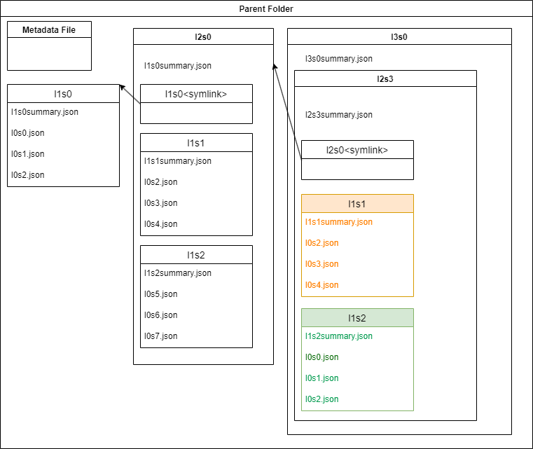
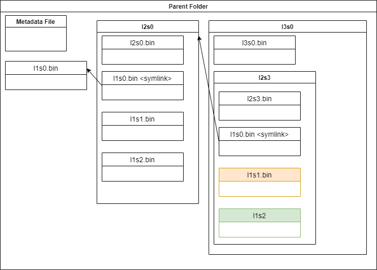
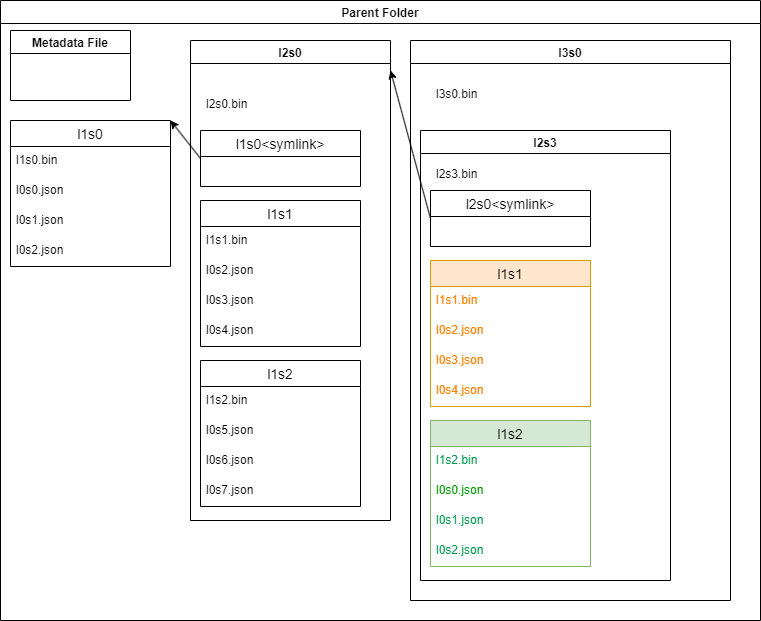

# SimpleZigguratDiskStructures

<strong>Author:</strong> Scott Morgan 
<strong>Edited:</strong> 2025-11-25 
<strong>Id:</strong> 1.3.6.1.4.1.33097.1.1.100 
<strong>Copywrite 2021 Adligo Inc</strong>

##### Document URLs:
- [SimpleZigguratDiskStructures.pdf](http://github.com/adligo/papers.adligo.com/data_structures/SimpleZigguratDiskStructures.pdf)
- [SimpleZigguratDiskStructures.odt](http://github.com/adligo/papers.adligo.com/data_structures/SimpleZigguratDiskStructures.odt)

##### Questions Comments:
[papers.adligo.com/issues](https://github.com/adligo/papers.adligo.com/issues)

[Papers Index](../README.md)

# Summary

&nbsp;&nbsp;&nbsp;This paper codifies the Ziggurat Disk Structure which is an abstract on-disk data structure for files and folders (aka Directories).  The Ziggurat Disk Structure stores files which are identified by a positive integer identifier (i.e. 0,1,2,3,4, etc).  It is designed to be human and machine readable, however the emphasis is machine readability and speed.  
&nbsp;&nbsp;&nbsp;There are several possible use-cases for the Ziggurat Disk Structure including;

* 1) Unbounded disk array structures for disk implementations of array style file slotting to support heap prioritization structures.

* 2) Storage of Blockchain Blocks as disk array slot elements, which can be summarized/split on checkpoints similar to the way relational databases split their log.  This facilitates pushing old segments of the blockchain to cold storage, however note the state of the blockchain at a particular checkpoint would need to be summarized.

* 3) Supporting relational, entity based and hybrid database storage structures and storage of indices of those collections/tables.  

&nbsp;&nbsp;&nbsp;The Ziggurat Disk Structure is designed to be layered on standard UNIX (Apple/Mac) and Windows file systems as well as GFS (Google File System), HDFS (Hadoop File System) and can be adapted to other physical disk structures.  It consists of a virtual associative array structure inspired by Peter van Emde Boaz Trees.  However, it makes use of a fractal like disk pattern as the data elements are NOT expected to be known at the time of structure initialization.
   
# Table of Contents
- [The Virtual Ziggurat Disk Structure Elements](#the-virtual-ziggurat-disk-structure-elements)
    - [Diagram #1](#diagram-1)
    - [Diagram #2](#diagram-2)
- [The Physical to Virtual Ziggurat Disk Structure Mappings](#The-Physical-to-Virtual-Ziggurat-Disk-Structure-Mappings)
    - [Diagram 3 Entity per File](diagram-3-entity-per-file)
    - [Diagram 4 Multiple Entities per File / RDBMS Style](#diagram-4-multiple-entities-per-file-/-rdbms-style)
    - [Diagram 5 Hybrid Entity Relational](#diagram-5-hybrid-entity-relational)
- [Conclusion](#conclusion)
- [Citations / References](#citations-/-references)	

## The Virtual Ziggurat Disk Structure Elements

&nbsp;&nbsp;&nbsp;Ziggurat Disk Structures map a virtual infinite associative array structure to a physical disk structure.   The virtual arrays may be of  different sizes.  However, it is recommended that they are all of the same size 2^X.  In the following example they are all 2^3, creating 8 slots per array.  To illustrate this we start at the bottom of the Ziggurat with the level zero arrays.   Below in diagram #1 we illustrate the parent array of the first three bottom child arrays and their association. 
   
## Diagram 1

&nbsp;&nbsp;&nbsp;There MAY be any number of virtual parent arrays to create a unbounded universe of slots (provided your programming language supports infinite positive numbers).  Note most programming languages do NOT support infinite positive integers.  However, very large positive integers are supported in code like Java's BigInteger class.    

&nbsp;&nbsp;&nbsp;Diagram #2 illustrates additional levels of virtual arrays and their association.  With levels 0-3 we would be able to store 64 data elements with a height under level 1, 512 after growing the virtual associative array structure to level 2 and 4,096 after growing the virtual associative array structure to level 2.  This growing virtual array structure can go on forever to continue to grow the structure to any size as necessary.   
   
## Diagram 2

## The Physical to Virtual Ziggurat Disk Structure Mappings

&nbsp;&nbsp;&nbsp;At the top of the physical Ziggurat Disk Structure some sort of manifest file should exist which identifies the size of the arrays.  This file could also contain other metadata.
&nbsp;&nbsp;&nbsp;Each data element is identified as being stored in a slot.  The slot numbers are abbreviated as sX, and the X comes from the respective virtual array slot (i.e. 0-7 in our example diagrams).  The levels are also abbreviated as lX and the X comes from the respective virtual associative arrays level (i.e. 0-3 in our examples.  This gives us names like;

- l0s0 → interpreted as level 0 slot 0
- l2s1 → interpreted as level 2 slot 1
- l3s7 → interpreted as level 3 slot 7

&nbsp;&nbsp;&nbsp;Under the top parent folder of the Ziggurat Disk Structure the slot zero folders are created for each virtual parent array.  You can see in Diagram #3 that the three files (l0s0.json, l0s1.json and l0s2.json) have been added under the l1s0 folder.  These are different files than the files in green at the right under the l1s0 folder.  Diagram #3 illustrates a entity style structure where each entity is stored in a separate physical file (i.e. l0s0.json). 
&nbsp;&nbsp;&nbsp;In this diagram the summary information would be included in the respective summary files (i.e. l1s0.bin).  Symlinks would be optional as they are supported by some file systems but not others.
   
## Diagram 3 Entity per File

## Diagram 4 Multiple Entities per File / RDBMS Style

&nbsp;&nbsp;&nbsp;Diagram #4 illustrates what a Ziggurat Disk Structure might look like if you were storing one data entity per row in binary files similar to the way most RDBMS (Relational Database Management Systems) do this.  For example l1s0.bin would contain 8 rows one row for each slot in the virtual array.  This is often how ACID (Atomic Consistent Independent Durable) transaction code is implemented. 
&nbsp;&nbsp;&nbsp;In this diagram the summary information would be included in the .bin file (i.e. l1s0.bin).  Symlinks would be optional as they are supported by some file systems but not others.

   
## Diagram 5 Hybrid Entity Relational
&nbsp;&nbsp;&nbsp;Diagram #5 illustrates a hybrid Ziggurat Disk Structure.  In this structure the traditional RDBMS binary file with one row per entity is augmented with the addition of one file per data entity.  This give the flexibility of faster query implementations (i.e. SQL) in the table structure, with the addition of more complex tree like data structures in the Json (or XML, etc) formats. 
&nbsp;&nbsp;&nbsp;In this diagram the summary information would be included in the .bin file (i.e. l1s0.bin).  Symlinks would be optional as they are supported by some file systems but not others.

## Conclusion

&nbsp;&nbsp;&nbsp;The Ziggurat Disk Structure is a simple versatile file and folder management system that can be leveraged to facilitate unbounded heap prioritization systems, blockchains and flexible RDBMS, entity and hybrid data storage systems.
   
## Citations / References	

["The Google File System" by Sanjay Ghemawat et al. (2003): This paper presents the design of the Google File System (GFS), a distributed file system that has inspired many modern distributed storage systems.](https://www.researchgate.net/publication/220910111_The_Google_File_System)

[https://hadoop.apache.org/docs/r1.2.1/hdfs_design.html](https://hadoop.apache.org/docs/r1.2.1/hdfs_design.html)

[Tromp, John & van Emde Boas, Peter. (1992). Associative Storage Modification Machines.. 291-313.](researchgate.net/profile/Peter-Van-Emde-Boas/publication/221024873_Associative_Storage_Modification_Machines/links/54102b840cf2df04e75b34ce/Associative-Storage-Modification-Machines.pdf)

© Copyright 2025 Adligo Inc
